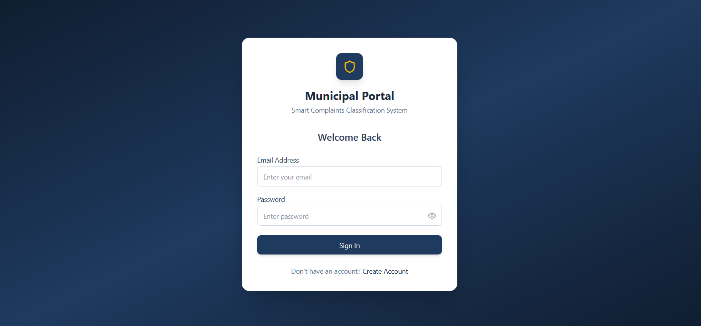
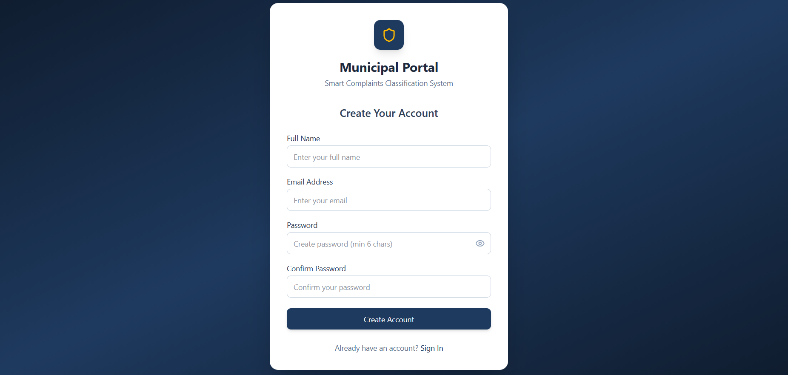
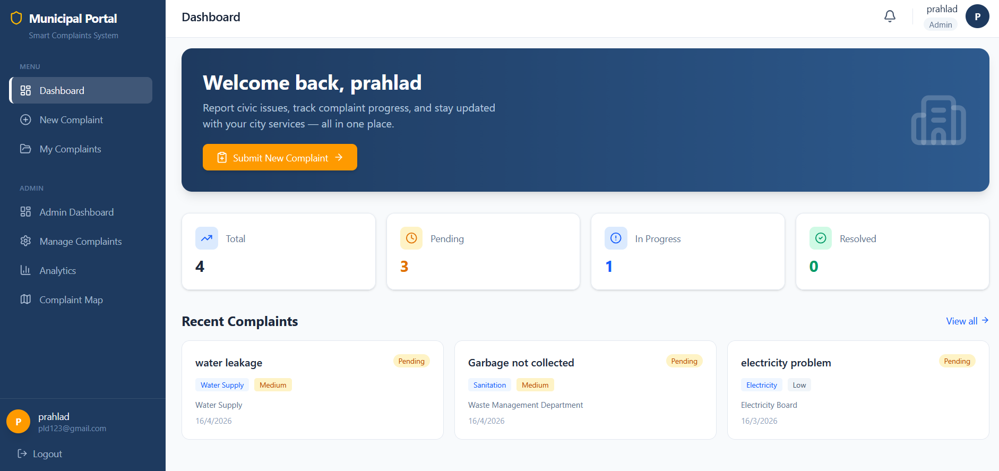
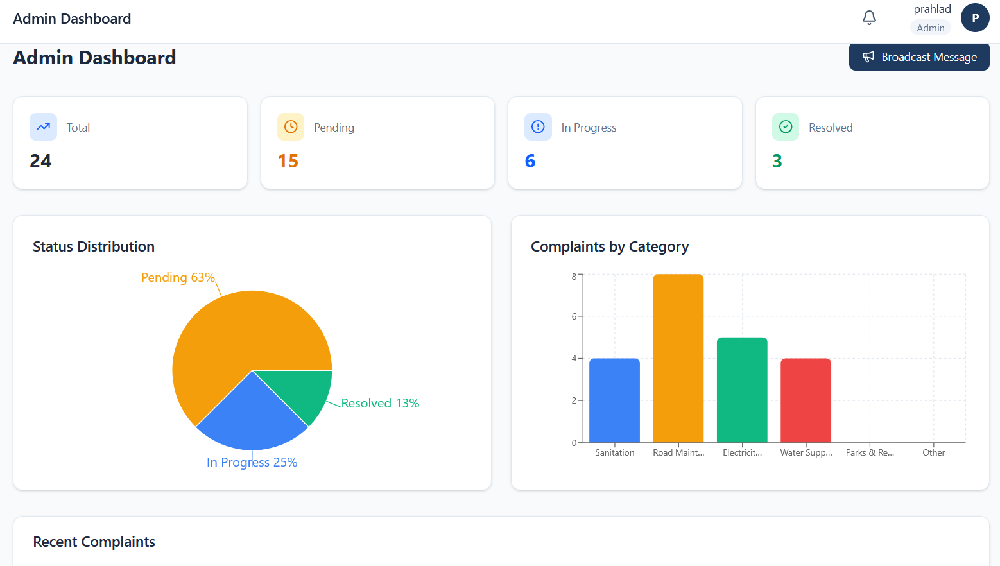
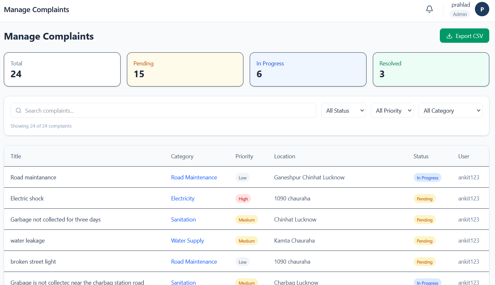
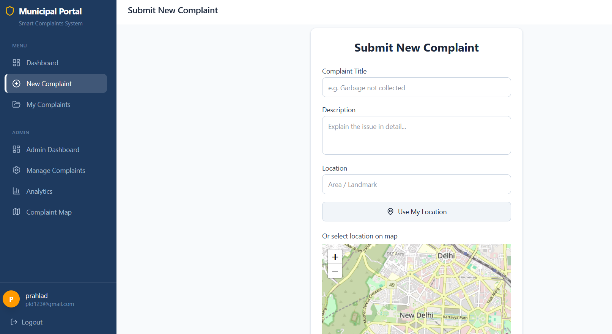
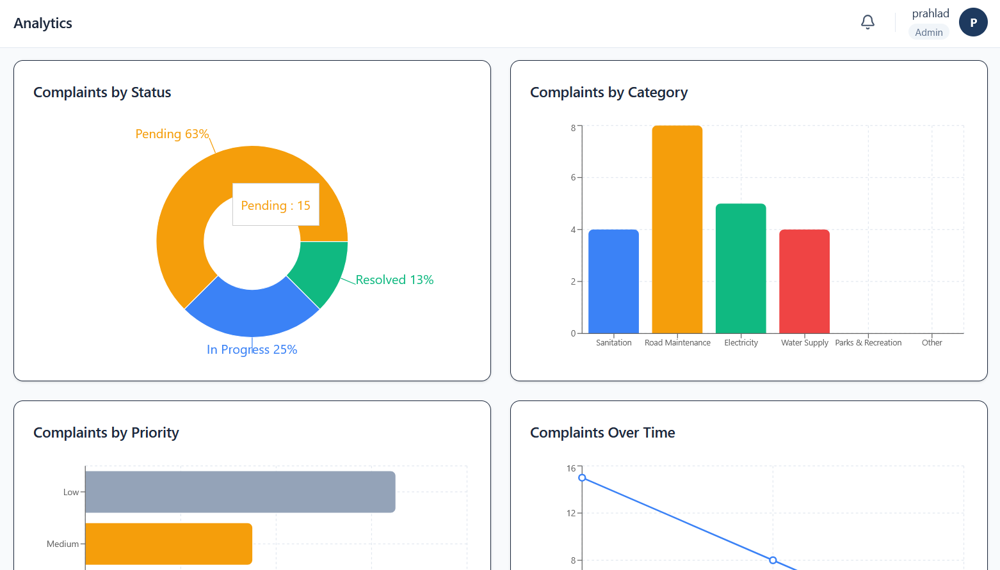

#  Smart Complaints Classification System

An AI-Powered Municipal Complaint Management System built using the MERN Stack.

The platform helps citizens report civic issues such as garbage collection, road damage, water leakage, and electricity problems while enabling municipal administrators to efficiently manage and monitor complaints.

---

#  Features

## 👨‍💻 Citizen Features
- User Registration & Login (JWT Authentication)
- Submit Complaints with Image Upload
- Automatic Complaint Classification
- GPS Location Capture
- Complaint Tracking System
- Complaint History Timeline
- Notifications System
- Responsive Dashboard UI

## 🛠 Admin Features
- Admin Dashboard
- Complaint Management Panel
- Complaint Status Updates
- Department Assignment
- Analytics Dashboard
- Complaint Map Visualization
- Search & Filters
- Real-time Complaint Monitoring

##  AI Features
- AI-Based Complaint Classification
- Priority Detection System
- Hybrid AI + Rule-Based Fallback System
- Smart Department Routing

---

# 🧱 Tech Stack

## Frontend
- React.js
- Tailwind CSS
- React Router
- Axios
- Recharts
- Leaflet Maps
- Lucide React Icons

## Backend
- Node.js
- Express.js
- MongoDB Atlas
- Mongoose
- JWT Authentication
- Multer (Image Upload)

## AI Integration
- Hugging Face API / OpenAI API
- Hybrid Rule-Based Classification

---

# 📂 Project Structure

```bash
municipal-project/
│
├── municipal-frontend/
│   ├── src/
│   ├── components/
│   ├── pages/
│   └── services/
│
├── municipal-backend/
│   ├── controllers/
│   ├── routes/
│   ├── middleware/
│   ├── models/
│   ├── utils/
│   └── uploads/
│
└── README.md
```

---

# ⚙️ Installation & Setup

## 1️⃣ Clone Repository

```bash
git clone https://github.com/YOUR_USERNAME/YOUR_REPOSITORY_NAME.git
```

---

## 2️⃣ Install Frontend Dependencies

```bash
cd municipal-frontend
npm install
```

---

## 3️⃣ Install Backend Dependencies

```bash
cd municipal-backend
npm install
```

---

#  Environment Variables

Create a `.env` file inside the backend folder.

```env
PORT=5000
MONGO_URI=YOUR_MONGODB_CONNECTION_STRING
JWT_SECRET=YOUR_SECRET_KEY
```

---

#  Run the Project

## Start Backend

```bash
cd municipal-backend
npm run dev
```

## Start Frontend

```bash
cd municipal-frontend
npm run dev
```

---

#  AI Workflow

```text
User submits complaint
        ↓
AI Classification
        ↓
Priority Detection
        ↓
Department Assignment
        ↓
Complaint Stored in MongoDB
```

---

#  System Modules

## Citizen Module
- Register/Login
- Submit Complaint
- Upload Images
- Track Complaint Status
- View Notifications

## Admin Module
- View All Complaints
- Update Status
- Assign Departments
- Analytics Dashboard
- Complaint Heatmap

---

#  Screenshots

##  Login Page



---

##  Register Page



---

##  Dashboard



---

##  Admin Analytics



---

##  Complaint Map


---

## 🗺 Manage Complaint 



---

## 🗺 New Complaint



---

## 🗺 Analytics



---

# Future Enhancements

- AI Image Detection
- Mobile Application
- Real-time Chatbot Support
- Duplicate Complaint Detection
- Smart City Analytics
- Email & SMS Notifications

---

#  Learning Outcomes

Through this project, the following concepts were implemented:

- MERN Stack Development
- RESTful API Design
- Authentication & Authorization
- AI Integration in Web Applications
- Dashboard UI Design
- Data Visualization
- Map Integration
- Error Handling & Middleware

---

#  Final Year Project

This project was developed as a Final Year Project for B.Tech Computer Science Engineering.

---

#  Author

## Prahlad Nishad
B.Tech Computer Science Engineering

---

 